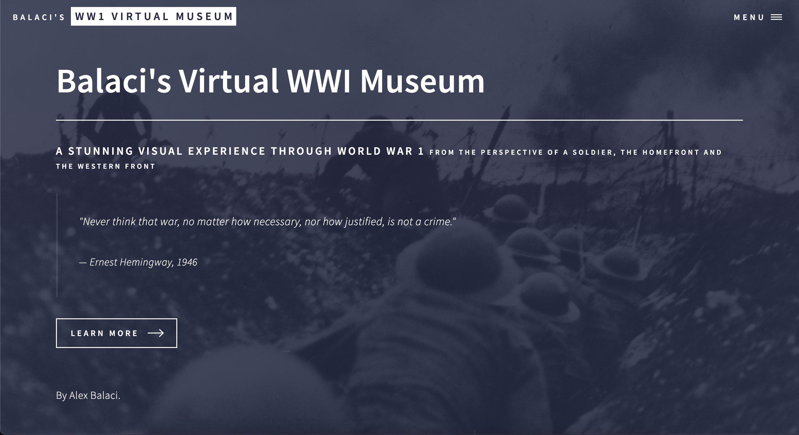
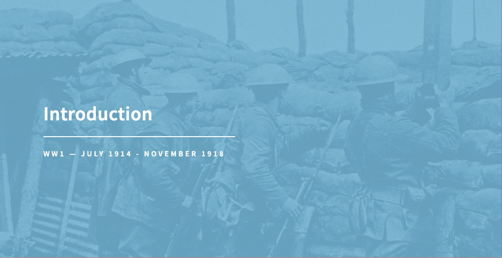
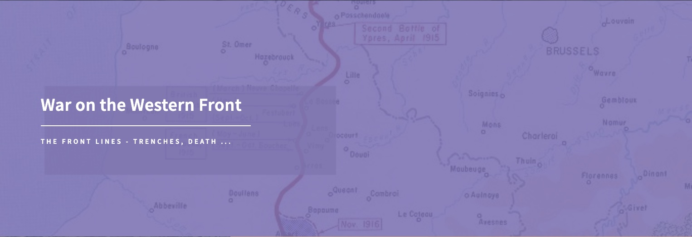
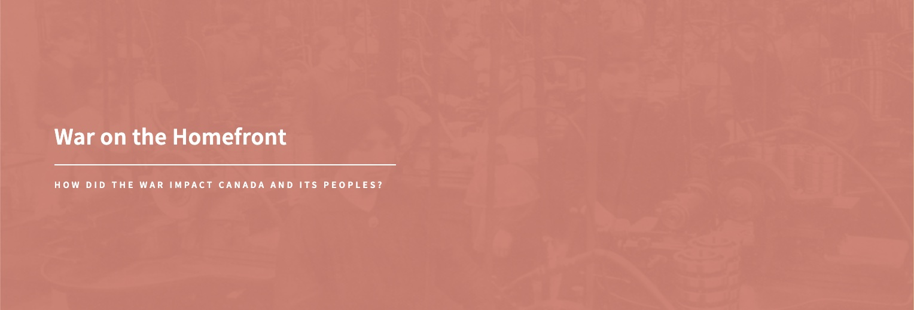
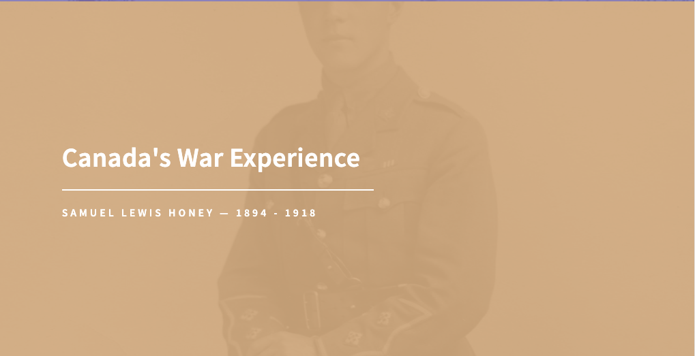

# World War I Virtual Museum

This project contains the code for a virtual museum about the first world war created for my grade 10 history class. It
was created using HTML, CSS, and JavaScript, using a template from [HTML5 UP](https://html5up.net/).

## Content:

| Introduction                                                                   | War on the Western Front                                                                    | War on the Homefront                                                                 | Canada's War Experience                                                                       |
| ------------------------------------------------------------------------------ | ------------------------------------------------------------------------------------------- | ------------------------------------------------------------------------------------ | --------------------------------------------------------------------------------------------- |
|  |  |  |  |

### The project is hosted on GitHub Pages and can be accessed [here](https://gbalaci.github.io/WWI-Virtual-Museum/).
